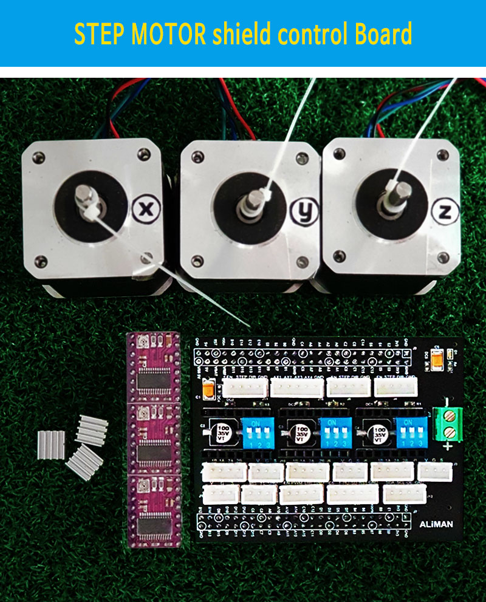

# STM32H750-Step-Motor
STM32H750VBT6 개발 보드에 올려서 사용할 수 있는 스텝모터 쉴드입니다.

---
## 특징
3D printer, CNC 등에 사용되는 스텝모터의 기본 동작원리와 응용을 위한 기본 개발 보드입니다.

1. Leib Ramp
    - 하나의 스텝 모터에 대해서 위치 및 속도 제어, 감속 가속 알고리즘을 구현한 소스입니다.

2. Grbl
    - CNC 에 사용되는 X, Y, Z 축의 모터와 스핀들 모터 제어 신호를 만들어 냅니다.
    - Grbl 을 포팅해 놓았습니다.
    - G-Code로 모터를 제어합니다.
    - 기구를 확장하면 CNC, 레이저 조각기를 제작할 수 있습니다.

----

## 제품 구입
제품을 구입하고 싶으시면 [유래텍](https://uraetech.co.kr)을 방문해 주세요.

